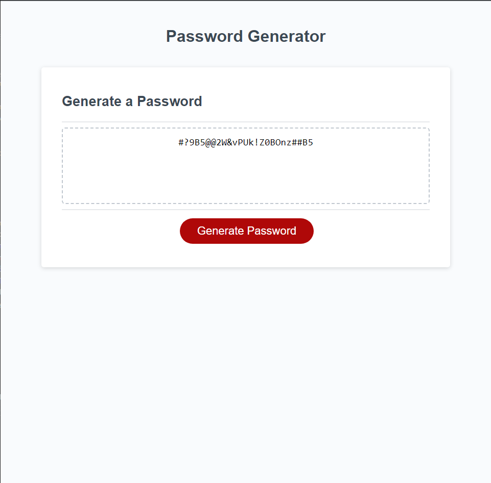

# Password-Generator

## Description

This password generator is made so a user can have a random password generated for their use. In this generator the user will have the option to choose from numbers, symbols, lowercase letter, and uppercase letters. Depending on what the user selects it will generate a password with the criteria that the user selected.

## Installation

N/A

## Usage

https://tylerkandarian.github.io/Password-Generator/

## Credits

https://www.w3schools.com/
https://developer.mozilla.org/en-US/
https://www.youtube.com/

## License

Please refer to the LICENSE in the repo.